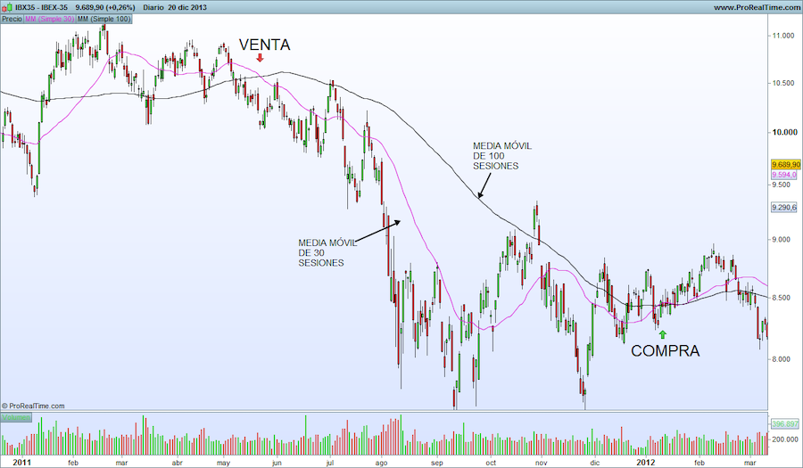

```{r chunk_setup, echo = FALSE}
knitr::opts_chunk$set(warning = FALSE, 
                      message = FALSE, 
                      comment = "",
                      fig.align = "center", 
                      fig.show = "hold",
                      fig.height = 4,
                      fig.width = 8,
                      out.width = "80%") 
```

```{r options_setup, echo = FALSE}
options(scipen = 999) #- para quitar la notacion cientifica
```

```{r librerias, echo = FALSE}
library(forecast)
library(ggplot2); theme_set(theme_bw())
library(gridExtra)
library(grid)
```

# Introducción

Recuerda que ya utilizamos la media móvil en el contexto de la descomposición. Se trataba de una media móvil centrada y se utilizaba para estimar la tendencia de una serie. Vamos ahora a ver con algo más de detalle el concepto de media móvil y como se puede usar para obtener predicciones.

El método de las medias móviles con fines predictivos aparece en los años 20, su uso se generalizó en los años 50 y sigue siendo un método utilizado en determinados campos, donde el fin último es capturar la tendencia a largo plazo de una serie.

Por ejemplo, si pinchas [aqui](https://momo.isciii.es/public/momo/dashboard/momo_dashboard.html#nacional) puedes ver el registro del número de muertes diarias (MoMo) que mantiene el _Ministerio de Ciencia e Innovación_. La línea negra es el número real de muertes y la línea azul es (más o menos) la media móvil de orden 365. La media móvil captura la tendencia en el número de muertes a largo plazo, es decir, cabe esperar que ambas lineas aparezcan siempre cercanas. Si se observa que ambas líneas se separan, debemos pensar que un causa no identificada está produciendo un exceso (o defecto) de muertes sobre su valor esperado.

En bolsa es muy habitual ver gráficos donde junto a la evolución del índice bursátil se muestra una media móvil de orden alto y otra de orden bajo. Cuando ambas líneas se cruzan, los analistas consideran que es buen momento para comprar (la media móvil de corto plazo pasa encima de la de largo plazo) o vender (la media móvil de corto plazo pasa por debajo de la de largo plazo).



\

Si te das cuenta, en ambos ejemplos **la media móvil se ha utilizado como señal de alarma** --en el primer caso de que algo está generando más o menos muertes de las esperadas y en el segundo caso de que es buen momento para comprar o vender--, pero no para realizar predicciones. En la actualidad, **es poco frecuente el uso de la media móvil con fines exclusivamente predictivos**. 

Sin embargo, por su sencillez de cálculo y su utilidad para identificar que el entorno de predicción está cambiando, vamos a dedicarles algo de tiempo a las medias móviles.

Antes de empezar, un par de aspectos adicionales a tener en cuenta. Desde un punto de vista teórico, **las medias móviles no pueden capturar la estacionalidad** de una serie así que solo se aplican a series que por su naturaleza no tengan esta componente; desde un punto de vista práctico, `R` no dispone de una función que permita de forma cómoda obtener una media móvil, las predicciones intra-muestrales, las extra muestrales y el error. Algo como hemos visto en temas previos y veremos en los posteriores. Solventaremos este aspectos creando nuestra propia función. 

\
\

# Media móvil simple para series sin tendencia (ni estacionalidad)

\

## Definición

El método de la media móvil simple es adecuado para una serie estacionaria y sin estacionalidad. Es decir, una serie que se mueve alrededor de un nivel constante. En este caso, **la predicción para un periodo es la media de las $r$ observaciones previas**. El valor $r$, denominado orden de la media móvil, es un parámetro que debe ser fijado por el investigador.

Definimos primero la media móvil _hacia atrás_ (_backward_) de orden $r$ para el periodo $t$ como
$$mm_t = \frac{1}{r}\sum_{i=0}^{r-1} y_{t-i} = \frac{y_t + y_{t-1} + \ldots + y_{t-r+1}}{r}$$
Observa que la media móvil hacia atrás se define de forma diferente a la media móvil _centrada_ que vimos en la descomposición por medias móviles.

A partir de $mm_t$ se define la ecuación de la __predicción intra-muestral__ como 
$$\widehat{y}_{t+1} = mm_t.$$
Podemos entender que $mm_t$ es una estimación del nivel de la serie en el periodo $t$ y como la serie es estacionaria (no cambia de nivel), este valor se usa como predicción para el periodo siguiente.

Es decir, la media móvil simple de orden $r$ usa para predecir el promedio los últimos $r$ datos. Es un punto medio entre el método ingenuo I, que para predecir usaba solo el ultimo dato, y la media simple, que promediaba todos los datos.

La primera __predicción extra-muestral__ es $\widehat{y}_{T+1} = mm_T$ y las restantes $\widehat{y}_{T+h} = \widehat{y}_{T+1}.$

Observa que:

* Para poder aplicar la media móvil de orden $r$ se necesitan al menos $r$ datos.
* Para los $r-1$ periodos iniciales no es posible calcular la media móvil y, por tanto, para los $r$ periodos iniciales no es posible obtener una predicción intra-muestral.
* El valor de $r$ debe fijarlo el investigador. Cuanto mayor es su valor, más _suave_ es la linea de predicciones obtenida y menos efecto tiene el valor de una observación individual sobre la predicción (véase la gráfica previa del Ibex35). En el caso límite $r=1$ se tiene el _método ingenuo_ y para $r=T$ el _método de la media_.

Veamos un sencillo ejemplo numérico. 

La siguiente tabla muestra la aplicación del método de las medias móviles para los 10 últimos datos de la serie Libros. La primera columna indica el año y la segunda el valor de la serie _Libros_. La tercera columna, _mm_, es la media móvil de orden 5 y la siguiente columna, _Yhat_, la predicción de Libros, es decir la columna _mm_ retrasada un periodo. La columna _Res_ (error de predicción) se calcula restando a la serie original (columna _Libros_) la predicción intra-muestral (columna _Yhat_). Observa que en el proceso se han perdido 5 datos para la predicción y el residuo al inicio de la serie.

```{r, echo = FALSE}
mm <- function(x, r = 3, h = 5) {
  z <- NULL
  z$x <- x
  z$orden = r
  
  TT <- length(x)
  inicio <- start(x)
  frecuencia <-frequency(x)
  
  z$mm <- stats::filter(x, rep(1/r, r), side = 1)
  z$fitted <- ts(c(NA, z$mm[-TT]), start = inicio, freq = frecuencia)
  z$mean <- ts(rep(z$mm[TT], h), start = time(x)[TT] + 1/frecuencia, freq = frecuencia)
  z$residuals <- x - z$fitted
  
  class(z) <- "forecast"
  z
}

libros <- read.csv2("./series/libros.csv", header = TRUE)
libros <- ts(libros[, 2], start = 1993, frequency  = 1)
librosb <- subset(libros, start = length(libros) - 9, end = length(libros))

mmLibros <- mm(librosb, r = 5)

datos <- data.frame(
  Fecha = time(librosb),
  Libros = as.numeric(librosb),
  mm = round(as.numeric(mmLibros$mm), 2),
  Yhat = round(as.numeric(mmLibros$fitted), 2),
  Res = round(as.numeric(mmLibros$residuals), 2)
)

datos
```

Tu mismo puedes comprobar que 
$$mm_{2013} = \frac{`r paste(librosb[1:5], collapse = " + ")`}{5} = `r datos$mm[5]`$$
y la primera predicción extra-muestral seria la media de las 5 últimas observaciones $\widehat{Libros}_{2019} = mm_{2018} = `r tail(mmLibros$mean, 1)`$

\


## Ejemplo de aplicación con Libros 

Vamos a usar el método de medias móviles para predecir la serie Libros. `R` proporciona varias funciones que permiten calcular la media móvil simple: `filter` del paquete `stats`,  `ts_ma` de `TSstudio`, `sma` de `smooth`, `ma` de `forecast` o `movavg` de `pracma`. Sin embargo, ninguna de estas funciones es tan completa como las vistas en el tema previo y permiten obtener la media móvil, la estimación, la predicción y el error con una sola función.

Para resolver este inconveniente vamos a programar nuestra propia función `mm` 

```{r, eval = FALSE}
mm <- function(x, r = 3, h = 5) {
  z <- NULL
  z$x <- x
  z$orden = r
  
  TT <- length(x)
  inicio <- start(x)
  frecuencia <-frequency(x)
  
  z$mm <- stats::filter(x, rep(1/r, r), side = 1)
  z$fitted <- ts(c(NA, z$mm[-TT]), start = inicio, freq = frecuencia)
  z$mean <- ts(rep(z$mm[TT], h), start = time(x)[TT] + 1/frecuencia, freq = frecuencia)
  z$residuals <- x - z$fitted
  
  class(z) <- "forecast"
  z
}
```

La función `mm` precisa de tres argumentos, una serie temporal, el orden de la media móvil $r$ y el horizonte de previsión $h$. Los dos últimos argumentos están fijados a 3 y 5 como opciones por defecto. El núcleo de la función es `filter`, que calcula la media móvil simple --realmente la función calcula una media ponderada hacia atrás (argumento `side = 1`). 

La función `mm` devuelve un objeto que contiene la serie original (`x`), el orden de la media móvil (`orden`), la media móvil (`mm`), la serie ajustada o predicción intra-muestral a un periodo vista (`fitted`), la predicción (`forecast`) y el error de estimación (`error`).

**Nota:** la función `filter` (librería `stats`), tiene como primer argumento la serie y el segundo argumento, `rep(1/r, r)`, son los pesos de la media móvil $1/r$ repetidos $r$. El tercer argumento indica si la media es centrada `side = 2` (como la usada en el método de descomposición visto en el tema 2) o hacia atrás `side = 1`. 

```{r}
mmLibros <- mm(libros, r = 5, h = 5)
```

La figura 1 muestra la serie Libros, las previsiones intra-muestrales y las previsiones extra-muestrales, que son constantes. 
 
```{r}
autoplot(libros, series = "Libros",
         xlab = "",
         ylab = "Títulos",
         main = "Figura 1. Libros y predicción con media móvil de orden 5") +
  autolayer(mmLibros$fitted, series = "Pred. intra") + 
  autolayer(mmLibros$mean, series = "Pred. extra")
```

Podemos ahora obtener los diferentes indicadores de bondad de ajuste del modelo (error de predicción intra-muestral) con la función `accuracy`.

```{r}
accuracy(mmLibros)
```

El MAPE de 11.5% evidencia que las predicciones no son muy adecuadas, resultado lógico si tenemos en cuenta que estamos aplicando a una serie con tendencia un método de ajuste y predicción para series sin tendencia.

Podríamos probar con otros valores para el orden de la media móvil e identificar el que genera el menor error extra-muestral para el horizonte de previsión deseado.

\
\

# Dobles medias móviles para series con tendencia (pero sin estacionalidad)

\

## Definición

El método de dobles medias móviles es adecuado para una serie no estacionaria y sin estacionalidad y supone que la tendencia es localmente lineal. En este caso, para obtener una predicción en el periodo $t+1$ con datos hasta el periodo $t$ necesitamos dos componentes:

* La estimación del nivel de la serie en el periodo $t$, que denominaremos $l_t$
* La estimación de la pendiente de la serie en el periodo $t$, que denominaremos $b_t$

A partir de estas componentes, obtenidas en el periodo $t$ se tendría que la predicción en el periodo $t+1$ es:
$$\widehat{y}_{t+1} = l_t+b_t.$$

Veamos como podemos obtener el nivel $l_t$ y la pendiente $b_t$ usando una doble media móvil.

* El primer paso es obtener la media móvil simple de orden $r$ tal y como vimos en el epígrafe previo

$$mm_t =  \frac{y_t + y_{t-1} + \ldots + y_{t-r+1}}{r}.$$

* El segundo paso consiste en calcular un media móvil simple de la media móvil obtenida en el paso 1, es decir, una doble media móvil, también de orden $r$, y que denominaremos $dmm_t$

$$dmm_t  = \frac{mm_t + mm_{t-1} + \ldots + mm_{t-r+1}}{r}.$$

Se puede demostrar que $mm_t$ es una estimación del nivel de la serie en el periodo $t - \frac{r-1}{2}$ y que $dmm_t$ es una estimación del nivel en el periodo $t - (r - 1)$. Teniendo en cuenta estos resultados, podemos estimar el valor del nivel de la serie en el periodo $t$ como
$$l_t = 2mm_t - dmm_t.$$

Por otra parte, la pendiente en el periodo $t$ se puede obtener como
$$b_t = \frac{2}{r-1}(mm_t - dmm_t).$$

A partir estas dos componentes, la ecuación de la __predicción intra-muestral__ es 
$$\widehat{y}_{t+1} = l_t + b_t$$
y la ecuación de __predicción extra-muestral__ es 
$$\widehat{y}_{T+h}=l_T + h b_T.$$ 

Veamos otro sencillo ejemplo numérico construido a partir del método de las dobles medias móviles para los 10 últimos datos de la serie Libros y con un orden $r=3$. La primera columna indica el año y la segunda el valor de la serie _Libros_. La tercera columna, _mm_, es la primera media móvil de orden 3 y la siguiente columna, _dmm_, la segunda media móvil. A partir de ellas se calculan las dos siguientes columnas _l_ y _b_, el nivel y la pendiente respectivamente. La columna _Yhat_ es la predicción de Libros y la columna _Res_ (error de predicción) se calcula restando a la serie original (columna _Libros_) la predicción intra-muestral (columna _Yhat_). Observa que en el proceso se han perdido 5 datos para la predicción y el residuo al inicio de la serie. En general, en una doble media móvil de orden $r$ se pierden $2r - 1$ datos al inicio de la serie.

```{r, echo = FALSE}
dmm <- function(x, r = 3, h = 5) {
  z <- NULL
  z$x <- x
  z$orden = r
  
  TT <- length(x)
  inicio <- start(x)
  frecuencia <-frequency(x)
  
  z$mm1 <- stats::filter(x, rep(1/r, r), side = 1)
  z$mm2 <- stats::filter(z$mm1, rep(1/r, r), side = 1)
  
  z$l <- 2 * z$mm1 - z$mm2
  z$b <- 2 * (z$mm1 - z$mm2) / (r - 1)
  
  z$fitted <- ts(c(NA, z$l[-TT] + z$b[-TT]), start = inicio, freq = frecuencia)
  z$mean <- ts(z$l[TT] + (1:h) * z$b[TT], start = time(x)[TT] + 1/frecuencia, freq = frecuencia)
  z$residuals <- x - z$fitted
  class(z) <- "forecast"
  z
}

dmmLibros <- dmm(librosb)

datos <- data.frame(
  Fecha = time(librosb),
  Libros = as.numeric(librosb),
  mm = round(as.numeric(dmmLibros$mm1), 2),
  dmm = round(as.numeric(dmmLibros$mm2), 2),
  l = round(as.numeric(dmmLibros$l), 2),
  b = round(as.numeric(dmmLibros$b), 2),
  Yhat = round(round(as.numeric(dmmLibros$fitted), 2), 2),
  Res = round(round(as.numeric(dmmLibros$residuals), 2), 2)
)


datos
```

Tu mismo puedes comprobar que 
$$
\begin{aligned}
   mm_{2011} & = \frac{`r paste(librosb[1:3], collapse = " + ")`}{3} = `r datos$mm[3]` \\
   dmm_{2013} & = \frac{`r paste(datos$mm[3:5], collapse = " + ")`}{3} = `r datos$dmm[5]`\\
   l_{2013} & = 2\cdot mm_{2013} - dmm_{2013} =  2 \cdot `r datos$mm[5]` - `r datos$dmm[5]` = `r datos$l[5]` \\
   b_{2013} & = \frac{2}{3-1}(mm_{2013} - dmm_{2013}) =  `r datos$mm[5]` - `r datos$dmm[5]` = `r datos$b[5]` \\
   \hat y_{2014} & = l_{2013} + b_{2013} = `r datos$l[5]`  `r datos$b[5]` = `r datos$Yhat[6]`
\end{aligned}
$$

La primera predicción extra-muestral seria la suma del nivel y la pendiente de la última observación

$$\widehat{Libros}_{2019} = l_{2018} + b_{2018} = `r datos$l[10] + datos$b[10]`$$

y la segunda predicción extra-muestral seria el nivel más dos veces la pendiente de la última observación:

$$\widehat{Libros}_{2020} = l_{2018} + 2\cdot b_{2018} = `r datos$l[10] + 2*datos$b[10]`.$$

\

## Ejemplo de aplicación con Nacimientos

Veamos un ejemplo de aplicación de las dobles medias móviles con la serie Nacimientos anualizada.

El método de las dobles medias móviles no está implementado en `R`, al menos hasta donde llega mi conocimiento. Para resolver este inconveniente vamos a programar nuestra propia función `dmm`. No tendrás ninguna dificultad en ver como funciona la función y como va creando cada uno de los elementos necesarios --primera y segunda media móvil, nivel y pendiente-- para obtener finalmente la serie ajustada, las predicciones y el error.

```{r, eval = FALSE}
dmm <- function(x, r = 3, h = 5) {
  z <- NULL
  z$x <- x
  z$orden = r
  
  TT <- length(x)
  inicio <- start(x)
  frecuencia <-frequency(x)
  
  z$mm1 <- stats::filter(x, rep(1/r, r), side = 1)
  z$mm2 <- stats::filter(z$mm1, rep(1/r, r), side = 1)
  
  z$l <- 2 * z$mm1 - z$mm2
  z$b <- 2 * (z$mm1 - z$mm2) / (r - 1)
  
  z$fitted <- ts(c(NA, z$l[-TT] + z$b[-TT]), start = inicio, freq = frecuencia)
  z$mean <- ts(z$l[TT] + (1:h) * z$b[TT], start = time(x)[TT] + 1/frecuencia, freq = frecuencia)
  z$residuals <- x - z$fitted
  class(z) <- "forecast"
  z
}
```

### Identificación del mejor modelo {-}

Podemos aplicar el método de la doble media móvil para diferentes órdenes $r$ y comprobar para cual de ellos se obtiene el menor valor del criterio de bondad de ajuste deseado. Realizaremos este ejercicio considerando como indicador de bondad de ajuste el MAPE pero en dos escenarios: previsiones intra-muestrales a un periodo vista y origen de predicción móvil.

```{r}
nacimientos <- read.csv2("./series/nacimientos.csv", header = TRUE)
nacimientos <- ts(nacimientos[, 2],
                  start = c(1975, 1),
                  frequency = 12)
nacimientos <- aggregate(nacimientos, FUN = sum)
```

__Selección usando previsiones intra-muestrales a un periodo vista__

La siguiente rutina calcula el MAPE para el método de la doble media móvil con órdenes desde 2 hasta 10. (¿Ves por qué en una doble media móvil el orden debe ser de 2  o superior?)

```{r}
MAPE <- rep(NA, 9)
names(MAPE) <- 2:10
for (r in 2:10) {
  dmmNacimientos <- dmm(nacimientos, r = r)
  MAPE[r - 1] <- accuracy(dmmNacimientos)[5]
}
MAPE
```

Podemos concluir que el orden óptimo es 2, donde se alcanza el menor MAPE.

__Selección usando origen de predicción móvil__

Dado que nuestro interés está en la calidad de las previsiones, vamos a obtener el MAPE para el método de la doble media móvil usando origen de predicción móvil con horizontes temporales de 1 a 5 años. Consideraremos órdenes desde 2 hasta 10. A fin de capturar la tendencia decreciente de los últimos años, consideraremos 30 como el mínimo número de datos para hacer las estimaciones

```{r}
k <- 30                   #Minimo numero de datos para estimar
h <- 5                    #Horizonte de las prediciciones
TT <- length(nacimientos) #Longitud serie
s <- TT - k - h           #Total de estimaciones

MAPE <- matrix(NA, nrow = 9, ncol = 5)
rownames(MAPE) <- 2:10
colnames(MAPE) <- 1:h

for (r in 2:10) {

  tmpMape <- matrix(NA, s + 1, h)
  
  for (i in 0:s) {
  
    train.set <- subset(nacimientos, start = i + 1, end = i + k)
    test.set <-  subset(nacimientos, start = i + k + 1, end = i + k + h)
    
    dmmNacimientos <- dmm(train.set, r = r, h = h)
    tmpMape[i + 1, ] <- 100*abs(test.set - dmmNacimientos$mean)/test.set
  }
  MAPE[r - 1, ] <- colMeans(tmpMape)
}
MAPE
```

En la tabla previa, cada fila hace referencia a un orden de la doble media móvil desde 2 hasta 10; y cada columna hace referencia a un horizonte temporal de predicción. Por ejemplo, usando un orden igual a 4 y para un horizonte de predicción de 2 periodos, el error medio de predicción extra-muestral es de 6.89%. Observa que con independencia del horizonte temporal de predicción considerado, el error se hace mínimo para un orden de las medias móviles de 2.

Podemos concluir que, dado que nuestro interés es minimizar el error de las predicciones extra-muestrales, el valor óptimo del orden de la doble media móvil es 2. La figura 2 muestra la serie Nacimientos, la previsiones intra-muestrales y las previsiones extra-muestrales para dicho orden. Observa como en los dos cambios de tendencia, la serie ajustada (línea azul) va con un poco de retraso. A la doble media móvil le cuesta identificar e incorporar los cambios de tendencia.

```{r}
dmmNacimiemtos <- dmm(nacimientos, r = 2, h = 5)
autoplot(nacimientos, series = "Nacimientos",
         xlab = "",
         ylab = "Bebés",
         main = "Figura 2. Nacimientos y predicción con doble media móvil de orden 2") +
  autolayer(dmmNacimiemtos$fitted, series = "Pred. intra") + 
  autolayer(dmmNacimiemtos$mean, series = "Pred. extra")
```

\
\
\
\